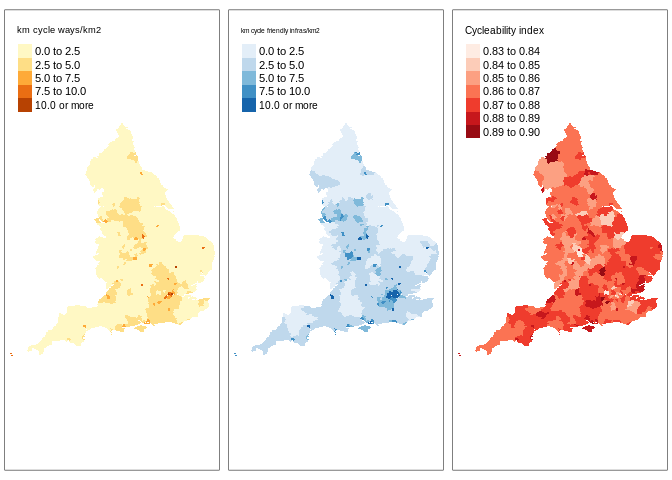
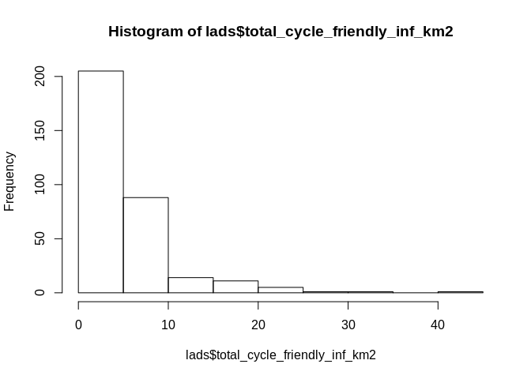

LADS OSM data
================
Eugeni Vidal
29/09/2019

<!-- README.md is generated from README.Rmd. Please edit that file -->

## Introduction

This is a script to prepare the data from Open Streets Maps (OSM) for
the paper “Inequalities in cycling participation in England”. Three
potential variables could be collected from this dataset: (1) Type of
infrastructure, (2) Volume of vehicles in infrastructure, (3) Quietness
of infrastructure.

## Data preparation

### Load OSM national dataset

``` r
# Load data
## Load infras data
  infras = readRDS("Data/ways_all.Rds")
## Create length_m variable.
infras$length_m = as.numeric(st_length(infras))
## Load lads data
lads = sf::read_sf("https://opendata.arcgis.com/datasets/fab4feab211c4899b602ecfbfbc420a3_3.geojson")
lads = read_sf("Local_Authority_Districts_December_2017_Generalised_Clipped_Boundaries_in_United_Kingdom_WGS84.geojson") %>% 
  st_transform(27700) # add geometry
# plot(las$geometry) # ckeck visually
lads = lads %>% filter(str_detect(lad17cd, "E")) # only England
```

### Create cycle-friendly infrastructure categories

``` r
# Create categories of infrastructure datasets based on https://wiki.openstreetmap.org/wiki/Bicycle#cite_note-anyroad-1. 
## Create cycleways highway dataset
i_cycleway = filter(infras, highway == "cycleway")
## Create cycleways left or right dataset
i_left_cycleway = filter(infras, cycleway.left!= "no" & highway !="cycleway")
i_right_cycleway = filter(infras, cycleway.right!= "no" & highway !="cycleway") 
## Create living streets dataset
i_living_street = filter(infras, highway == "living_street" & cycleway.right == "no" & cycleway.left == "no")
## Create Shared Path dataset
i_shared_path = filter(infras, roadtype == "Shared Path" & cycleway.right == "no" & cycleway.left == "no")
## Create 20mph zones dataset
i_20mph = filter(infras, (highway != "cycleway" & highway != "living_street" & roadtype != "Shared Path" & cycleway.left == "no" & cycleway.right == "no") &  maxspeed <= "20")
```

### Create a cyclability variable

### Agregate per local autority districts (LADS)

``` r
# Aggregate infrastructure variables to lads
lads$length_infras = aggregate(infras["length_m"], lads, FUN = sum)$length_m
# Aggregate cycleways highway
lads$length_cycleway = aggregate(i_cycleway["length_m"], lads, FUN = sum)$length_m
## Replace NA by 0
lads$length_cycleway[is.na(lads$length_cycleway)] = 0
# Aggregate cycleways left or right
lads$length_r_cycleway = aggregate(i_right_cycleway["length_m"], lads, FUN = sum)$length_m
lads$length_l_cycleway = aggregate(i_left_cycleway["length_m"], lads, FUN = sum)$length_m
## Replace NA by 0
lads$length_r_cycleway[is.na(lads$length_r_cycleway)] = 0
lads$length_l_cycleway[is.na(lads$length_l_cycleway)] = 0
# Aggregate length living streets
lads$length_living_streets = aggregate(i_living_street["length_m"], lads, FUN = sum)$length_m
## Replace NA by 0
lads$length_living_streets[is.na(lads$length_living_streets)] = 0
# Aggregate shared paths
lads$length_shared_paths = aggregate(i_shared_path["length_m"], lads, FUN = sum)$length_m
## Replace NA by 0
lads$length_shared_paths[is.na(lads$length_shared_paths)] = 0
# Aggregate length 20mph
lads$length_20mph = aggregate(i_20mph["length_m"], lads, FUN = sum)$length_m
## Replace NA by 0
lads$length_20mph[is.na(lads$length_20mph)] = 0
```

``` r
# Aggregate cyclability indicator
lads$cyclability = aggregate(infras["value"], lads, na.rm = TRUE, FUN = mean)$value
```

## Maps

``` r
tmap_mode("view")
#> tmap mode set to interactive viewing
lads = lads %>% select(lad17nm, total_cycleways_km2, total_cycle_friendly_inf_km2, cyclability)
# Map km cycle ways/km^2
p1 <- tm_shape(lads) +
  tm_fill("total_cycleways_km2", title="km cycle ways/km2",breaks=c(seq(0, 10, by=2.5), Inf))
```

``` r
tmap_mode("view")
#> tmap mode set to interactive viewing
# Map km cycle friendly infras/km^2
p2 <- tm_shape(lads) +
  tm_fill("total_cycle_friendly_inf_km2", title="km cycle friendly infras/km2", breaks=c(seq(0, 10, by=2.5), Inf), palette="Blues")
```

``` r
tmap_mode("view")
#> tmap mode set to interactive viewing
# Map index of cycleability
p3 <- tm_shape(lads) +
  tm_fill("cyclability", title="Cycleability index", palette="Reds")
```

``` r
current.mode <- tmap_mode("plot")
#> tmap mode set to plotting
tmap_arrange(p1, p2, p3)
#> Some legend labels were too wide. These labels have been resized to 0.63. Increase legend.width (argument of tm_layout) to make the legend wider and therefore the labels larger.
#> Some legend labels were too wide. These labels have been resized to 0.63. Increase legend.width (argument of tm_layout) to make the legend wider and therefore the labels larger.
```

<!-- -->

``` r
tmap_mode(current.mode) 
#> tmap mode set to interactive viewing
```

## Doubts and questions

  - Data is very skewed to the left.

<!-- end list -->

``` r
# Infrastructure data very skezed to the left. 
hist(lads$total_cycle_friendly_inf_km2)
```

<!-- -->

``` r
#hist(log(lads$total_cycle_friendly_inf_km2))
```

This might be due to the fact that cycling infrastructure tend to be
concentrated in urban areas, but also because collaborations in big
cities are usually higher than in rural areas. Way to check this? The
solution could be to analyse only urban areas.

  - Should I get other variables from this dataset such as volume of
    traffic and quietness. How to aggregate this data. Using the mean?

  - Change view mode format maps and name of lads

  - Why I cannot knit it?

  - Create a github repository to share.
