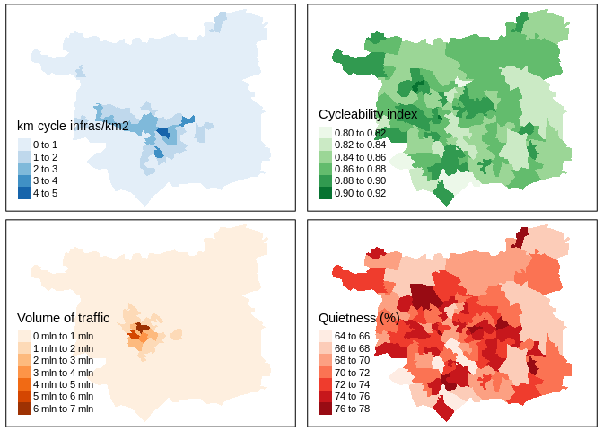
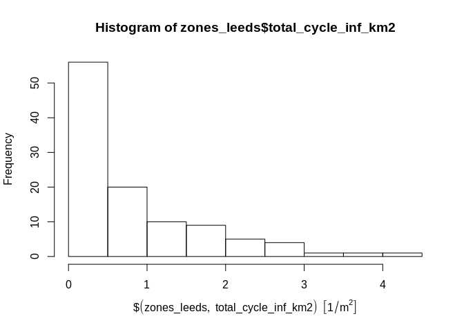
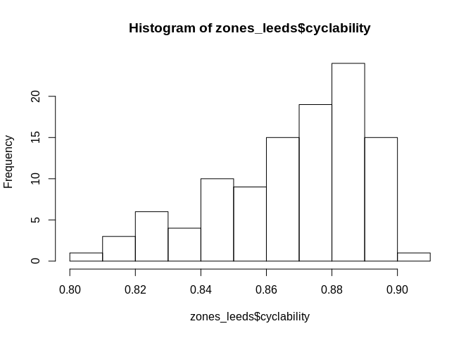
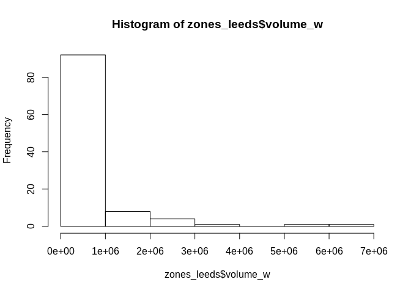
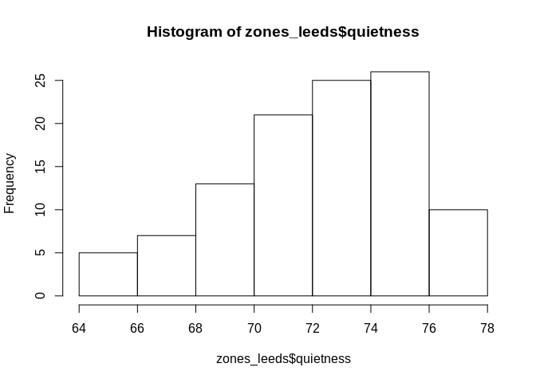

Test script to prepare the CyIPT data for the paper ‘Inequalities in
cycling participation in England’
================
Eugeni Vidal
03/10/2019

## Introduction

This is the script to prepare the **CyIPT** data for the paper
“Inequalities in cycling participation in England”. Four potential
indicators are created using this dataset:

1)  Km cycle-friendly infrastructure/km2,
2)  Cyclability index,
3)  Average volume traffic, and
4)  Quietness.

The first indicator can be divided into 2: km of cycle tracks/km2, and
km of cycle lanes/km2. The cyclability index is calculated giving
different weight to each type of road in which cycling is allowed. The
average volume of traffic is weighted by the flow of cyclists are
expected in a future escenario. Quietness is a measure calculated by the
cycle street project
<https://www.cyclestreets.net/help/journey/howitworks/>.

The indicator is calculated in Leeds areas as a test file to run later
at national level. Testing in areas Leeds will help to run the code
faster and smoother than doing it in the whole
nation.

## Data preparation

### Load CyIPT and areas dataset

``` r
# # Load the data - once, so don't re run multiple times. To create the original file replace infras_test and zones_leeds by infras and lads repsectively.
#
# ## Load infras data
# infras = readRDS("Data/ways_all.Rds")
# 
# ## Filter only leeds
# Leeds <- lads %>%
#   filter(lad17nm=="Leeds")
# infras_test <- infras[Leeds, ]
# 
# # save test data - don't rerun
# saveRDS(infras_test, "Data/infras_test.Rds")
```

``` r
# Load infras test
infras_test = readRDS("Data/infras_test.Rds")

# Load Leeds zones
zones_leeds <- pct::get_pct_zones(region = "west-yorkshire") %>% st_transform(27700)
zones_leeds <- zones_leeds %>% 
  filter(lad_name == "Leeds") %>% 
  select(geometry)
zones_leeds$st_areashape <- st_area(zones_leeds) # add area

# test calculating length of cycleway in zones across leeds
#zones_leeds$length_all = aggregate(infras_test["length_m"], zones_leeds, FUN = sum)$length_m
#infras_test$length_cycleway = (infras_test$highway == "cycleway") * infras_test$length_m
#zones_leeds$length_cycleway = aggregate(infras_test["length_cycleway"], zones_leeds, FUN = sum)$length_cycleway

#plot(zones_leeds["length_cycleway"])
#plot(infras_test %>% filter(highway == "cycleway"))
```

### Infrastructure per area

``` r
# Extract categories of infrastructure datasets based on https://wiki.openstreetmap.org/wiki/Bicycle#cite_note-anyroad-1. 
## Extract cycleways highway dataset
i_cycle_tracks = filter(infras_test, highway == "cycleway") 
## Extract cycleways left or right dataset
i_cycle_lanes = filter(infras_test, (cycleway.left != "no" | cycleway.right != "no")& highway != "cycleway")
```

``` r
# Aggregate infrastructure variables to lads
# lads$length_infras = aggregate(infras["length_m"], lads, FUN = sum)$length_m
# Aggregate cycleways highway
zones_leeds$length_cycle_tracks = aggregate(i_cycle_tracks["length_m"], zones_leeds, FUN = sum)$length_m
## Replace NA by 0
zones_leeds$length_cycle_tracks[is.na(zones_leeds$length_cycle_tracks)] = 0
# Aggregate cycleways left or right
zones_leeds$length_cycle_lanes = aggregate(i_cycle_lanes["length_m"], zones_leeds, FUN = sum)$length_m
## Replace NA by 0
zones_leeds$length_cycle_lanes[is.na(zones_leeds$length_cycle_lanes)] = 0
```

### Cyclability

``` r
# Shouldn't I calculate this indicator by lenght?
# Aggregate cyclability indicator
zones_leeds$cyclability = aggregate(infras_test["value"], zones_leeds, na.rm = TRUE, FUN = mean)$value
```

### Volume of traffic

``` r
# Create a weighted volume column by cycling flow
## Shold I use the function weighted.mean() or multiply by dutch scenario as Robin suggested?
infras_test$volume_w = infras_test$aadt * infras_test$pct.census
# Aggregate volume_w indicator
zones_leeds$volume_w = aggregate(infras_test["volume_w"], zones_leeds, na.rm = TRUE, FUN = mean)$volume_w
```

### Quietness

``` r
# Sholdn't I calculate quietness by lenght?

# Aggregate cyclability indicator
zones_leeds$quietness = aggregate(infras_test["quietness"], zones_leeds, na.rm = TRUE, FUN = mean)$quietness
```

``` r
# save test data
saveRDS(zones_leeds, "Data/zones_leeds.Rds")
```

## Visualisation variables

### Maps

``` r
tmap_mode("view")
```

    ## tmap mode set to interactive viewing

``` r
# Map km cycle friendly infras/km^2
p1 <- tm_shape(zones_leeds) +
  tm_fill("total_cycle_inf_km2", title="km cycle infras/km2", palette="Blues")
```

``` r
tmap_mode("view")
```

    ## tmap mode set to interactive viewing

``` r
# Map index of cycleability
p2 <- tm_shape(zones_leeds) +
  tm_fill("cyclability", title="Cycleability index", palette="Greens")
```

``` r
tmap_mode("view")
```

    ## tmap mode set to interactive viewing

``` r
# Map volume of traffic
p3 <- tm_shape(zones_leeds) +
  tm_fill("volume_w", title="Volume of traffic", palette="Oranges")
```

``` r
tmap_mode("view")
```

    ## tmap mode set to interactive viewing

``` r
# Map quietness
p4 <- tm_shape(zones_leeds) +
  tm_fill("quietness", title="Quietness (%)", palette="Reds")
```

``` r
current.mode <- tmap_mode("plot")
```

    ## tmap mode set to plotting

``` r
tmap_arrange(p1, p2, p3, p4)
```

<!-- -->

``` r
tmap_mode(current.mode) 
```

    ## tmap mode set to interactive viewing

### Data distribution

  - Data visualisation. The total\_cycle\_friendly\_inf\_km2 data is
    very skewed to the left. However, the cyclability index looks
    normalised.

<!-- end list -->

``` r
# Infrastructure data very skezed to the left. 
hist(zones_leeds$total_cycle_inf_km2)
```

<!-- -->

``` r
#hist(log(lads$total_cycle_friendly_inf_km2))
```

``` r
hist(zones_leeds$cyclability)
```

<!-- -->

``` r
hist(zones_leeds$volume_w)
```

<!-- -->

``` r
hist(zones_leeds$quietness)
```

<!-- -->

The skeweness of the first indicator is because cycling infrastructure
is very low and tend to be concentrated in urban areas. But it might be
also because OSM collaborations are higher in urban than in rural areas.
How can we check this? One solution could be to analyse only specific
urban areas - those in where the level of contributions is enough to
make the data reliable.

The cyclability index data is normalised because it takes into account
all types of infrastructure, not only cycle-friendly infrastructure. It
looks much more reliable.

## Doubts and questions

  - Infrastrucutre indicator. Should I add quiet streets? Shold I
    calculate the proportion of cycling network comparing cars intead of
    bike infras km2?

  - How to calculate the quietness and cycleability by length?

  - Is ok the way I calculated the volume weighted variable?
